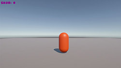
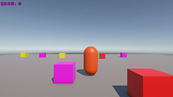

# 🎮 Unity3D_Renkli_Kutu_Toplama_Oyunu (Unity Sınav2 Projesi)

## 🎯 Oyun Hakkında

Bu proje, Unity 3D kullanılarak geliştirilmiş basit ve eğlenceli bir kutu toplama oyunudur. Oyuncular karakterlerini hareket ettirerek sahada rastgele dağılmış renkli kutuları toplar ve puan kazanırlar. Her renk farklı puan değerine sahiptir.

## 🖼️ Oyun Görselleri

<p align="left">
  
  
  
</p>

## ✨ Özellikler

- **3D Karakter Kontrolü**: WASD veya ok tuşları ile akıcı hareket
- **Dinamik Skor Sistemi**: Gerçek zamanlı puan takibi
- **Renkli Kutu Sistemi**: 5 farklı renk, 5 farklı puan değeri
- **Otomatik Kutu Oluşturma**: Oyun başlangıcında 20 adet rastgele kutu
- **Cinemachine Kamera**: Smooth third-person kamera takibi
- **TextMeshPro UI**: Modern ve şık kullanıcı arayüzü

### Puan Sistemi
| Renk | Puan Değeri |
|------|-------------|
| 🔴 Kırmızı | 10 puan |
| 🔵 Mavi | 20 puan |
| 🟢 Yeşil | 30 puan |
| 🟡 Sarı | 50 puan |
| 🟣 Mor | 100 puan |

### Oyun Akışı
1. Oyun başladığında sahada 20 adet rastgele renkli kutu oluşur
2. Karakterinizi kutulara doğru hareket ettirin
3. Kutulara temas ettiğinizde kutular kaybolur ve puan kazanırsınız
4. Sol üst köşedeki skor tabelasından puanınızı takip edin

## 🛠️ Kurulum

### Gereksinimler
- Unity 6.1 veya üzeri
- TextMeshPro paketi
- Cinemachine paketi (kamera kontrolü için)

### Adım Adım Kurulum

#### 1. Yeni Proje Oluşturma
```
Unity Hub → New Project → 3D Template → Create
```

#### 2. Oyuncu (Player) Kurulumu
- **Hierarchy** → Sağ tık → **3D Object** → **Capsule**
- İsim: `Player`
- Tag: `Player`
- Transform Position: `(0, 1, 0)`
- **Add Component** → **Rigidbody**
  - Constraints: Freeze Rotation **X, Y, Z** ✓
- `PlayerController.cs` scriptini ekle
- Cinemachine Third Person kamera ayarları yap

#### 3. Toplanabilir Kutu Prefab
- **Hierarchy** → **3D Object** → **Cube**
- İsim: `CollectibleBox`
- Tag: `Collectible` (yeni tag oluştur)
- Scale: `(1, 1, 1)`
- **Add Component** → **Box Collider**
  - Is Trigger: ✓
- `CollectibleBox.cs` scriptini ekle
- Project penceresine sürükleyerek **Prefab** oluştur
- Hierarchy'den orijinali sil

#### 4. Zemin Oluşturma
- **3D Object** → **Plane**
- Scale: `(5, 1, 5)`
- Position: `(0, 0, 0)`

#### 5. UI (Skor Sistemi)
- **Hierarchy** → **UI** → **Canvas**
  - Canvas Scaler ayarları:
    - UI Scale Mode: **Scale With Screen Size**
    - Reference Resolution: **1920x1080**
    - Match: **0.5**
- Canvas altına **UI** → **Text - TextMeshPro**
  - İsim: `ScoreText`
  - Text: `"Skor: 0"`
  - Font Size: **60**
  - Font Style: **Bold**
  - Color (HEX): **#8B008B** (Mor)
  - Anchor Preset: **Top Left**

#### 6. Game Manager Kurulumu
- **Hierarchy** → Boş GameObject oluştur
- İsim: `GameManager`
- `ScoreManager.cs` scriptini ekle
- Inspector'da **Score Text** alanına `ScoreText` objesini sürükle

#### 7. Box Spawner Kurulumu
- **Hierarchy** → Boş GameObject oluştur
- İsim: `BoxSpawner`
- `BoxSpawner.cs` scriptini ekle
- Inspector'da **Box Prefab** alanına `CollectibleBox` prefab'ını sürükle

## 📁 Proje Yapısı
```
Assets/
├── Scripts/
│   ├── PlayerController.cs      # Oyuncu hareket kontrolü
│   ├── CollectibleBox.cs        # Kutu davranışları ve renk sistemi
│   ├── ScoreManager.cs          # Skor yönetimi ve UI güncellemesi
│   └── BoxSpawner.cs            # Kutu oluşturma sistemi
├── Prefabs/
│   └── CollectibleBox.prefab    # Toplanabilir kutu prefab'ı
└── Scenes/
    └── SampleScene.unity          # Ana oyun sahnesi
```

## 🔧 Teknik Detaylar

### PlayerController.cs
- Rigidbody tabanlı fizik kontrolü
- Input.GetAxis ile smooth hareket
- Configurable hareket hızı

### CollectibleBox.cs
- Trigger collision detection
- Random renk atama sistemi
- Renk bazlı puan değerleri
- ScoreManager ile entegrasyon

### ScoreManager.cs
- Singleton pattern implementasyonu
- TextMeshPro ile UI güncellemesi
- Global skor yönetimi

### BoxSpawner.cs
- Start metodunda otomatik spawn
- Configurable spawn alanı (-10 ile 10 arası)
- Prefab instantiation